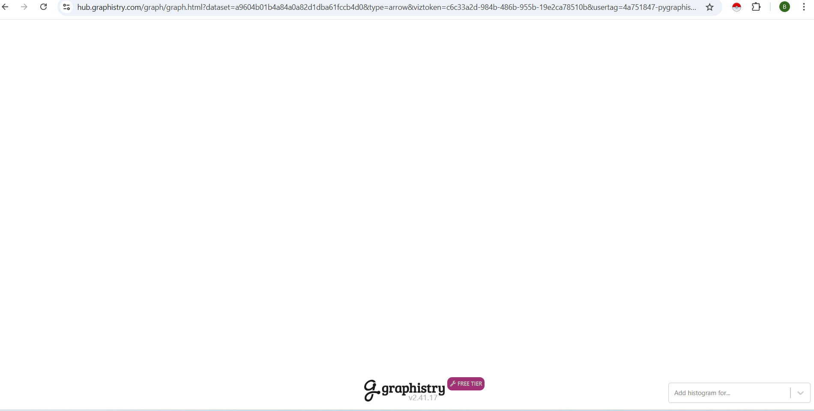
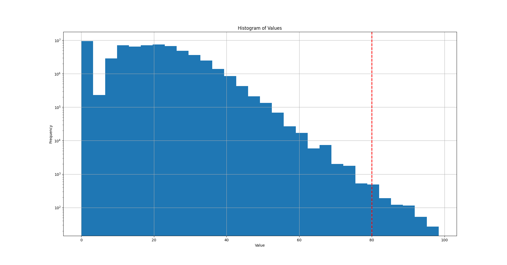
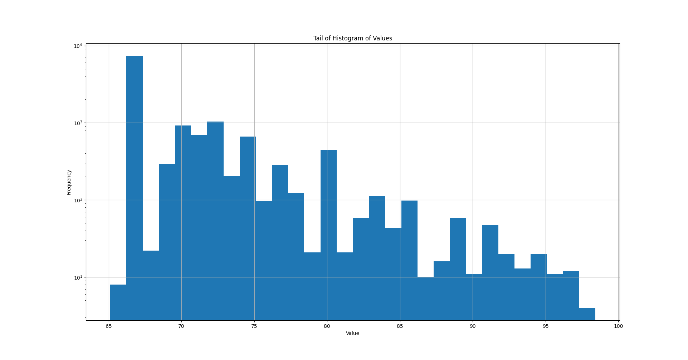

# Boiler-Room-Analytics
This repository contains a Community Analysis of the music played in Boiler Room DJ sets over time. In the future, I intent to mine out the genre of each community with NLP techniques.

Click on the graphic below to check out and interact the network of artists
<table style="width:100%;">
  <tr valign="top">
    <td align="center">
    <a href="https://hub.graphistry.com/graph/graph.html?dataset=dc93907254204c92a86b67fa958ee0c8" target="_blank">Demo: Interactive visualisation of Boiler Room tracklists</a> 
    </td>
  </tr>
</table>

## Data Source
I scraped tracklist data from 1001 Tracklist (see the [code structure](#code-structure) below). 1001 Tracklist contains tracklist data from shows and DJ sets maintained by fans and listeners, and for Boiler Room goes back to 2010. Their website also uses a number of APIs (e.g. beatport) for track information. Given it is community maintained, Data quality is *very patchy*, i.e., genre is often missing, Artists spelling can change, especially with accented characters, and so on.

I also used Spotify's and Discogs' respective APIs to retrieve more genre data for the NLP part of the project. Three notes:
- Spotify currently only provides genres for **Artists** rather than individual songs. This made searching easier, but limits the precision of NLP. Given the communities are clusters of artists, I am not bothered by this.
- Discogs does not seem to have great precision on genres within dance music - often songs will only be tagged with "Electronic" (TODO pending results of data collection, as of writing my internet is too bad where I am to actually perform this analysis) 
- Given the tracklist data quality is low, this made it difficult to search for these tracks and Artists on the two platforms, further limiting quality.

## Code structure
Given this was a relatively quick-and-dirty analysis mostly done for my interest and a bit of novelty, the code is not structured or written particularly elegantly. I took a scripting approach, with the scripts operating in order:

> #### 1. Scrape Tracklist data from 1001 tracklist
> The file [scrape_live_1001tracklist_data.py](scrape_live_1001tracklist_data.py) extracts the data from 1001 Tracklists.
> To do so, I found an index page for Boiler Room sets on 1001 Tracklist. The function `get_urls_for_boiler_rooms` extacts each of these sets and their URL. The object `OneThousandOneTrackListPage` and its methods contain the behaviour for extracting the traclist.
>
> #### 2. Clean Data and perform Fuzzy Mutching
> The clean data script performs a few functions:
> - It performs some initially string cleaning and processing.
> - It also splits out all the artists/remixers etc. for a song. In the final analysis, all artists involved in a track being played (the DJ, the Artist(s), the Remixer(s)) will have an edge drawn between them. Doing this also aids in string cleaning
> - It then takes all the unique Artists (no matter what their envolvment) and performs a fuzzy matching exercise on all artists to all other artist. Any artists with more than an 80% string similarity are merged together
>
> I took the fuzzy matching approach to amend some of the data quality issues found in the 1001 tracklist data. Fuzzy matching is often not very precice (its in the name): setting the threshold too low will lead to completely different artists being merged together; setting it too high will limit how many true artists that should be merged will be merged.
> In this context, over-merging artists is a greater risk. This could lead to additional "bridge" connections between communities in the graph or incorrecet artists being placed into communities, which would make communitiy detection more difficult, less precise, and less accurate.
> I performed a brief analysis of the number/proportion of artists caught by 80% and did some manual review of the artists merged to validate the results (see [this file](Images/histogram_of_similarity_values.png) and [this file below]())
>
> 
> 
>
> #### 3. Retrieve Genre data from Spotify and Discogs
> Both of these services have APIs for searching for tracks and retrieving data on those results. Both also has a python packages for handling retrieving this data: [Spotipy](https://github.com/spotipy-dev/spotipy) and [Discogs client](https://github.com/joalla/discogs_client). Very handy.
> Note that as said above, the data quality is limited, both by the data quality upstream from 1001 Tracklists, and from these sources themselves.
>
> #### 4. Graph Aanlytics
> 

## ToDo List
- Perform genre data extraction from Spotify and Discogs (internet where I am is so bad I cannot maintain a connection for long enough)
  - asses data quality, clean if necessary
- design and perform NLP analysis for communities
- intergate two analyses
- Create a main.py to run all analysis

## Running Locally

